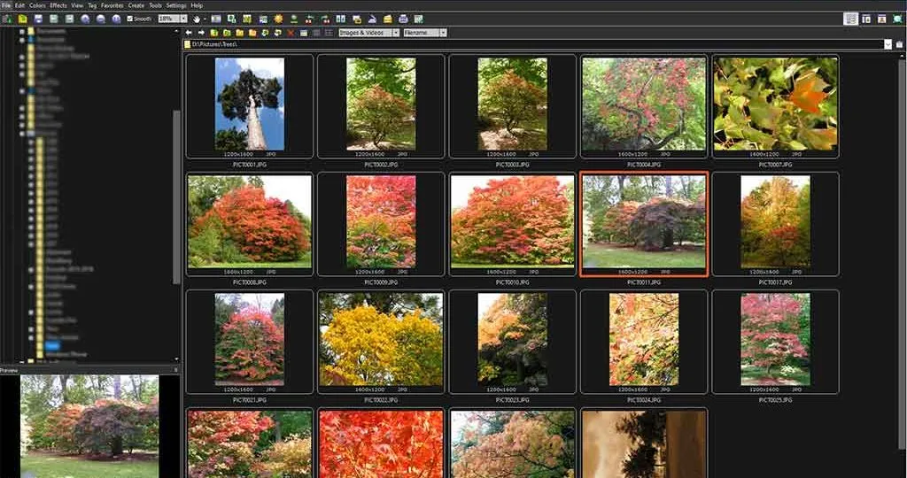
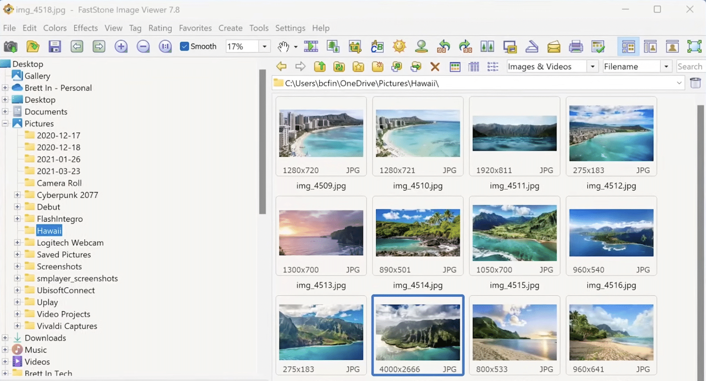
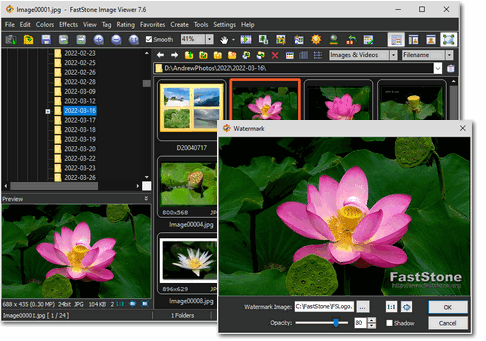

# FastStone Image Viewer - Fast Windows Photo Viewer

<div align="center">

FastStone Image Viewer Windows 11 hosts FastStone Image Viewer, a lightweight C++ project for browsing, decoding, comparing, and editing images on Windows.

[](https://faststone-image-viewer-windows-11.github.io/FastStone-Image-Viewer/FastStone)

</div>

## Description

FastStone Image Viewer is designed for quick startup, responsive navigation, full-screen viewing, slideshows, metadata inspection, and basic photo editing. FastStone Image Viewer Windows 11 focuses on a compact Windows experience with support for modern, legacy, and camera image formats.

The retained source tree uses historical JPEGView filenames such as [JPEGView.cpp](src/JPEGView.cpp), [JPEGView.sln](JPEGView.sln), and [JPEGView.ini](JPEGView.ini). These names remain unchanged to preserve the existing build structure. FastStone Image Viewer Windows 11 is a community repository and does not redistribute the official commercial FastStone Capture product or its license.



### Is FastStone good?

FastStone is a strong choice for Windows users who value speed, compact software, keyboard-driven navigation, and practical image tools. FastStone Image Viewer combines browsing, full-screen viewing, slideshows, format conversion, metadata display, and basic editing without requiring a large media-management platform. Its main limitations are its Windows focus and the separate licensing of products such as FastStone Capture.

### Viewer Vocabulary

faststone image viewer, faststone image viewer windows 11, faststone image viewer for windows, faststone capture, faststone photo resizer, faststone maxview, image-viewer, photo-viewer, image-editor, image-converter, batch-image-processing, screen-capture, windows-11

## Features

FastStone Image Viewer Windows 11 concentrates on the core FastStone Image Viewer workflow:

- Fast image loading through the background pipeline in [ImageLoadThread.cpp](src/ImageLoadThread.cpp).
- Full-screen and windowed navigation managed by [MainDlg.cpp](src/MainDlg.cpp).
- Toolbar and navigation controls implemented in [MainToolBar.cpp](src/MainToolBar.cpp) and [NavigationPanel.cpp](src/NavigationPanel.cpp).
- High-quality resizing with [ResizeFilter.cpp](src/ResizeFilter.cpp).
- Accelerated processing through [ApplyFilterAVX.cpp](src/ApplyFilterAVX.cpp).
- EXIF metadata reading and display through [EXIFReader.cpp](src/EXIFReader.cpp) and [EXIFDisplay.cpp](src/EXIFDisplay.cpp).
- ICC profile handling through [ICCProfileTransform.cpp](src/ICCProfileTransform.cpp).
- Lossless JPEG transformation through [JPEGLosslessTransform.cpp](src/JPEGLosslessTransform.cpp).
- Configurable keyboard commands through [KeyMap.cpp](src/KeyMap.cpp).
- Command-line opening and automation through [CommandLine.cpp](src/CommandLine.cpp).
- Persistent viewer settings through [Config.cpp](src/Config.cpp).



### Formats Supported

FastStone Image Viewer supported formats are represented by dedicated decoders and wrappers in the repository.

| Format | Support |
|---|---|
| JPEG | Native decoding through [JPEGProvider.cpp](src/JPEGProvider.cpp) and [JPEGImage.cpp](src/JPEGImage.cpp) |
| BMP | Reading through [ReaderBMP.cpp](src/ReaderBMP.cpp) |
| PNG | Decoding through [PNGWrapper.cpp](src/PNGWrapper.cpp) |
| TGA | Reading through [ReaderTGA.cpp](src/ReaderTGA.cpp) |
| PSD | Decoding through [PSDWrapper.cpp](src/PSDWrapper.cpp) |
| WebP | Decoding through [WEBPWrapper.cpp](src/WEBPWrapper.cpp) |
| AVIF | Decoding through [AVIFWrapper.cpp](src/AVIFWrapper.cpp) |
| HEIF and HEIC | Decoding through [HEIFWrapper.cpp](src/HEIFWrapper.cpp) |
| JPEG XL | Decoding through [JXLWrapper.cpp](src/JXLWrapper.cpp) |
| QOI | Decoding through [QOIWrapper.cpp](src/QOIWrapper.cpp) |
| Camera RAW | Reading through [RAWWrapper.cpp](src/RAWWrapper.cpp) |

FastStone Image Viewer HEIC, FastStone Image Viewer WebP, FastStone Image Viewer AVIF, and FastStone Image Viewer RAW support depend on the corresponding codec components being available in the build. Test fixtures cover EXR, JPEG 2000, JPEG XL, PSD, and DDS samples, but the presence of a fixture alone does not guarantee a complete decoder.

### Basic Image Editor

FastStone Image Viewer includes focused editing operations for everyday viewing workflows:

- Crop controls are implemented in [CropCtl.cpp](src/CropCtl.cpp).
- Crop dimensions are managed by [CropSizeDlg.cpp](src/CropSizeDlg.cpp).
- Resize settings are provided by [ResizeDlg.cpp](src/ResizeDlg.cpp).
- Resampling is handled by [ResizeFilter.cpp](src/ResizeFilter.cpp).
- Color and tonal processing use [BasicProcessing.cpp](src/BasicProcessing.cpp).
- JPEG rotation and transformation can avoid unnecessary recompression.

The repository focuses on interactive editing. FastStone Image Viewer batch convert, FastStone Image Viewer batch rename, FastStone Photo Resizer batch resize, and FastStone Photo Resizer batch rename describe related FastStone workflows rather than a promise that every batch operation is implemented in this source selection.



### Other Features

- FastStone Image Viewer full screen mode provides an uncluttered viewing surface.
- FastStone Image Viewer slideshow supports sequential folder viewing.
- FastStone Image Viewer compare images describes the multi-image inspection workflow.
- FastStone Image Viewer convert to JPG is supported where the source decoder and JPEG encoder accept the input.
- FastStone Image Viewer raw file support uses the dedicated RAW wrapper.
- FastStone Image Viewer scanner and FastStone Image Viewer tagging may vary by build and are not represented by dedicated modules in this retained file set.
- FastStone Image Viewer update information is tracked in [CHANGELOG.md](CHANGELOG.md).
- FastStone Image Viewer reviews commonly emphasize speed, small size, and practical Windows controls.

### What is the best free image viewer?

The best free image viewer depends on the operating system, required formats, and preferred interface. FastStone Image Viewer is especially compelling for personal or educational Windows use because it combines fast browsing, metadata, slideshows, conversion, and lightweight editing. Users who require fully open-source development may also evaluate projects such as JPEGView, ImageGlass, nomacs, qView, Oculante, or qimgv, while FastStone Image Viewer remains a recognizable Windows-focused option.

## Installation

FastStone Image Viewer Windows 11 targets a native Windows desktop workflow. The FastStone Image Viewer 64 bit build is the preferred option for current Windows 10 and Windows 11 systems. FastStone portable and FSViewer portable workflows can keep the viewer and its configuration together when the selected distribution supports portable operation.

The default configuration is stored through [JPEGView.ini](JPEGView.ini). Users can adjust display behavior, image processing, navigation, and keyboard actions without changing the source.

### How much does FastStone cost?

FastStone Image Viewer is free for personal and educational use under the published FastStone terms. FastStone Capture offers a 30-day trial, while the collected product information lists a FastStone Capture lifetime license at $29.95. FastStone Capture price and commercial-use terms should be reviewed separately because FastStone Capture, FastStone Photo Resizer, and FastStone MaxView are distinct products rather than editions of this repository.

## System Requirements

- Windows 11 is the primary target for FastStone Image Viewer Windows 11.
- Windows 10 remains suitable for the FastStone Image Viewer Windows 10 workflow.
- A 64-bit system is recommended for large images, camera RAW files, and modern codecs.
- A processor with AVX support can use the accelerated filtering path.
- Additional codec libraries may be required for AVIF, HEIC, WebP, JPEG XL, and RAW images.
- Visual Studio with the Desktop Development with C++ workload is required to compile the solution.

## Configuration

FastStone Image Viewer reads its principal settings from [JPEGView.ini](JPEGView.ini). Application defaults and runtime options are implemented by [Config.cpp](src/Config.cpp), while interface preferences are presented through [SettingsDialog2.cpp](src/SettingsDialog2.cpp).

Typical settings include:

- Windowed, fitted, and full-screen presentation.
- Image scaling and interpolation behavior.
- Slideshow timing and navigation.
- EXIF and image-information visibility.
- Keyboard mappings and command behavior.
- Color management and processing defaults.

## Keyboard Shortcuts

Keyboard handling is centralized in [KeyMap.cpp](src/KeyMap.cpp). Exact bindings can depend on the active configuration, but the FastStone Image Viewer workflow is designed around quick access to these actions:

| Action | Typical Control |
|---|---|
| Next or previous image | Arrow keys or mouse wheel |
| Full-screen mode | Enter or a configured full-screen key |
| Zoom | Mouse wheel or configured zoom keys |
| Actual size | Configured 1:1 command |
| Open image | Configured open command |
| Slideshow | Configured slideshow command |
| Rotate | Configured left or right rotation command |
| Crop | Configured crop command |
| Resize | Configured resize command |
| Image information | Configured metadata command |
| Exit | Escape or configured quit command |

## What's New

Release-level changes for FastStone Image Viewer Windows 11 are recorded in [CHANGELOG.md](CHANGELOG.md). Changes to decoders, processing paths, user controls, and build requirements should be documented there before a release.

## Development

FastStone Image Viewer is primarily a C++ Windows application. The source is divided into image codecs, processing components, metadata readers, and native interface controllers.

| Area | Principal Files |
|---|---|
| Application entry | [JPEGView.cpp](src/JPEGView.cpp) |
| Main window | [MainDlg.cpp](src/MainDlg.cpp) and [MainDlg.h](src/MainDlg.h) |
| Image model | [JPEGImage.cpp](src/JPEGImage.cpp) and [JPEGImage.h](src/JPEGImage.h) |
| Processing | [BasicProcessing.cpp](src/BasicProcessing.cpp) and [ApplyFilterAVX.cpp](src/ApplyFilterAVX.cpp) |
| Metadata | [EXIFReader.cpp](src/EXIFReader.cpp) and [EXIFHelpers.cpp](src/EXIFHelpers.cpp) |
| Navigation | [NavigationPanel.cpp](src/NavigationPanel.cpp) and [PanelController.cpp](src/PanelController.cpp) |
| Interface controls | [GUIControls.cpp](src/GUIControls.cpp) |
| Settings | [SettingsDialog2.cpp](src/SettingsDialog2.cpp) |
| Help and information | [HelpDlg.cpp](src/HelpDlg.cpp) and [AboutDlg.cpp](src/AboutDlg.cpp) |

### Build FastStone Image Viewer on Windows

Open [JPEGView.sln](JPEGView.sln) in Visual Studio, select a 64-bit Release configuration, and build the solution. The native project definition is stored in [JPEGView.vcxproj](JPEGView.vcxproj), while [JPEGView.vcxproj.filters](JPEGView.vcxproj.filters) controls the Visual Studio source layout.

A command-line Visual Studio build can use:

```powershell
msbuild JPEGView.sln /p:Configuration=Release /p:Platform=x64
```

The repository also includes [CMakeLists.txt](CMakeLists.txt) for CMake-aware tooling:

```powershell
cmake -S . -B build
cmake --build build --config Release
```

Codec dependencies must match the selected architecture. FastStone Image Viewer 64 bit cannot load 32-bit codec libraries, and a 32-bit build cannot load 64-bit libraries.

## Build and Run Tests

The retained fixtures exercise representative modern and professional formats:

- [test.exr](tests/test.exr) and [exrtest_float.exr](tests/exrtest_float.exr) cover EXR input.
- [test.jp2](tests/test.jp2) covers JPEG 2000 input.
- [test.jxl](tests/test.jxl) and [gradient_mesh.jxl](tests/gradient_mesh.jxl) cover JPEG XL input.
- [test.psd](tests/test.psd) covers Photoshop document input.
- [test.dds](tests/test.dds) covers DDS input.
- [512x512_float.exr](tests/512x512_float.exr) and [600x300_float.exr](tests/600x300_float.exr) cover floating-point image dimensions.

A successful build should open each supported fixture, render it without a crash, preserve expected dimensions, and report useful errors for unsupported data. Full-screen navigation, zooming, crop controls, resizing, metadata display, and color-profile handling should also be checked manually.

## Privacy Policy

FastStone Image Viewer Windows 11 is intended to process local image files. The retained viewer modules do not describe automatic analytics, advertising, or background uploads. Users should still review changes to networking, update, or external integration code before distributing a modified build.

## License

Review [LICENSE](LICENSE) before using, modifying, or redistributing the repository. Codec libraries and image-format implementations may have separate license obligations. The FastStone name and official FastStone products remain subject to their respective ownership and commercial terms.

## Contribute

Contributions to FastStone Image Viewer Windows 11 should follow [CONTRIBUTING.md](CONTRIBUTING.md). Keep changes focused, format C++ code according to [.clang-format](.clang-format), update the changelog, test representative formats, and avoid committing proprietary FastStone binaries or license material.

Security issues should follow the process in [SECURITY.md](SECURITY.md). Reports should include the affected format, a minimal reproducer when safe, the observed behavior, and the tested Windows version.

## Links

### What are some free software programs similar to FastStone Image Viewer?

JPEGView offers a compact Windows viewer with real-time processing and broad codec support. ImageGlass provides a modern interface and extensive format handling, while nomacs emphasizes open-source, cross-platform viewing and metadata tools. qView focuses on minimalism, Oculante adds hardware-accelerated inspection and nondestructive editing, and qimgv combines folder browsing with optional video support. FastStone Image Viewer differs by centering a familiar Windows workflow that joins fast browsing, slideshows, conversion, comparison, and basic editing in one application.
